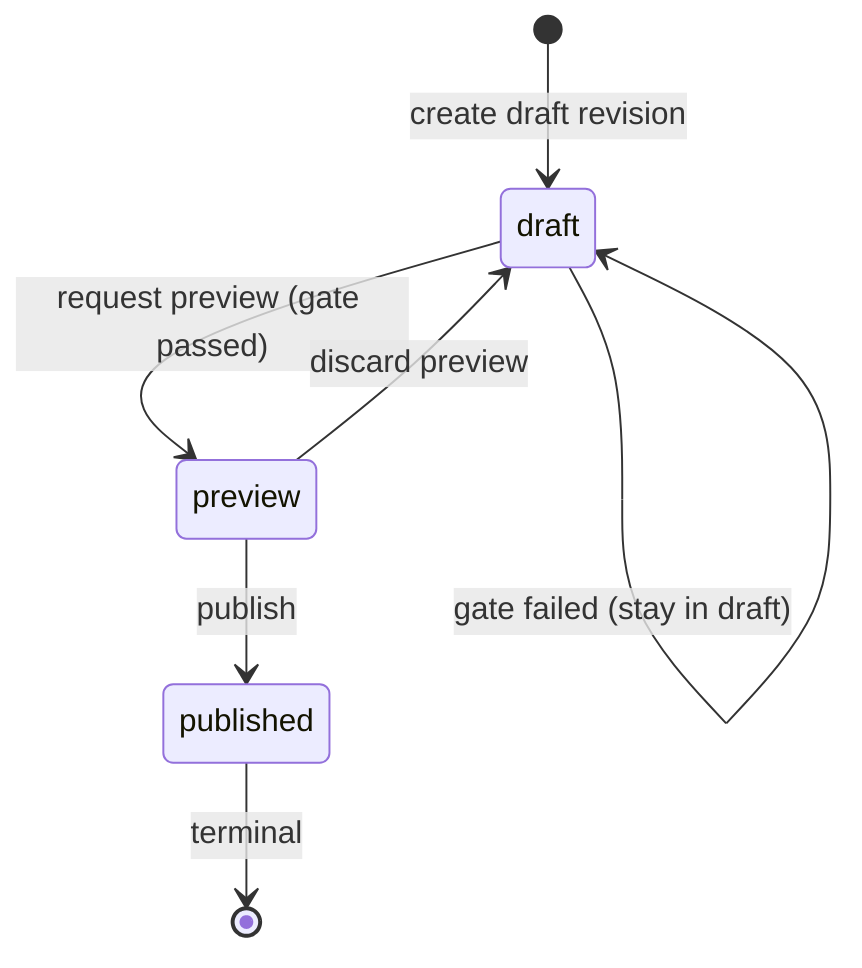

# STU-116 Design

## Metadata

- Linear issue: [STU-116 — STU-114: Design slice](https://linear.app/stunted-chicken-labs/issue/STU-116/stu-114-design-slice)
- Feature branch: `STU-116-stu-114-design-slice`
- Related spec: `docs/features/STU-116/spec.md`
- Related validation: `docs/features/STU-116/validation.md`
- Architecture reference: [STU-117 design](../STU-117/design.md), `metadata_domain`
- Figma: TBD when visual exploration starts

## Design summary

Ship a **wizard-shaped editor** mental model: pilots always know **where they
are** in connect → draft → preview → publish, what **actions** are legal, and
why the system **refuses** to advance when gates fail. Heavy tables use
**scannable lists** with row-level affordances for field edits, not a single
free-form document.

## Primary areas (information architecture)

1. **Source connect** — pick channel (`csv` | `spss` | `postgres`), provide
   locator, show ingestion progress. Surfaces read-only
   `IngestionSourceDescriptor` fields the pilot should confirm (kind + ref).
2. **Dataset context** — show `DatasetDefinition` name/id and active
   `DatasetInstance` the revision belongs to; always show **tenant context**
   (name or id per product policy) so pilots never edit the wrong workspace.
3. **Draft editor** — revision in `draft`: tabular or grouped list of metadata
   entries backed by opaque `body`; supports **multi-row selection** and **bulk
   edits** on the current selection (e.g. set the same label prefix on every
   selected field, or apply one value down a visible column). Scope is
   “whatever is selected in the grid,” not a separate abstract “pattern layer,”
   unless STU-122 adds grouping or regex-based rules.
4. **Preview request** — explicit CTA to run validation; show spinner / job
   state if preview is asynchronous in STU-122.
5. **Preview summary** — when `preview`: read-only snapshot with **gate outcome**
   banner. If gate failed while still in `draft`, show blocking messages
   (conceptual mapping to `PreviewGateReport.messages`).
6. **Publish / discard** — from `preview`, primary **Publish** and secondary
   **Discard preview** (returns to `draft`). **Published** view is read-only
   success state with link to start a **new draft** from the same instance.

## Lifecycle UX (aligned to domain)

| Domain state | Pilot-visible label (suggested) | Primary actions |
| ------------ | ------------------------------- | ---------------- |
| `draft`      | Draft                           | Edit, Run preview |
| `preview`    | Ready to publish                | Publish, Discard preview, Review preview summary |
| `published`  | Published                       | View only; “New draft” for same instance |

Illegal transitions should surface **inline errors** tied to the action (e.g.
“Fix blocking issues before preview”) not generic failures.

## Key flows

### Happy path

1. Connect source → system creates **draft** revision for the target instance.
2. Pilot edits metadata in **draft**; autosave or explicit save semantics are a
   build detail but the UI should never imply changes are live for analytics
   until **published**.
3. Pilot taps **Run preview** → backend returns gate result. If `passed`,
   transition to **preview** state UI.
4. Pilot reviews preview summary → **Publish** → **published** read-only view.

### Gate failure (remain in draft)

- Show a **blocking panel** or top banner listing messages (one bullet per gate
  message; support many messages).
- Keep the editor enabled unless product policy freezes edits during preview
  runs; default story: remain editable in `draft` after failure.
- Do **not** show partial `preview` state when gate fails (domain stays `draft`).

### Discard preview

- Confirm dialog warning that preview summary will be cleared and state returns
  to draft; no data loss to `body` implied, but pilot should understand
  **publish is no longer one click away**.

### Missing or unauthorized revision

- Single user-facing outcome: **“Revision not found or inaccessible.”** No
  distinction between wrong id and wrong tenant in copy (matches
  `MetadataNotFoundError` intent).

## Empty, loading, and wide-dataset patterns

- **Empty draft**: prompt to connect source or pick instance; link to docs for
  supported connectors.
- **Loading ingestion**: skeleton on table; do not show stale `body` as current.
- **Wide tables**: frozen primary column (field id / label), horizontal scroll,
  optional column chooser; bulk actions on selection.

## Grounding and trust

- **Before publish**, always show **what dataset instance** and **definition**
  the revision applies to (ids or human names as available).
- **Preview summary** should call out **compatibility** or **policy** issues in
  plain language; tie lists of messages to actionable rows where possible (build
  maps messages to fields in STU-122 when metadata supports it).
- **Published** state: short **“what was published”** recap when the stack can
  supply it (e.g. publish time, initiating user). STU-117’s `MetadataRevision`
  does not yet carry audit fields; STU-122 should persist or join **provenance**
  (revision extension, audit log, or events) before the UI promises timestamps
  or actors.

## Accessibility and usability

- State (`draft` / `preview` / `published`) exposed to assistive tech (region
  label or live region on transition).
- Gate messages: preserve order; allow copy-to-clipboard for support.
- Bulk edit: keyboard-accessible selection and clear **undo** expectations
  (implementation detail, but design must not rely on hover-only actions).

## Open items for STU-122

- Autosave vs explicit save; optimistic UI rules.
- Whether preview runs sync or async; progress UI.
- Exact mapping from opaque `body` keys to column labels.
- **Preview “diff”**: `InMemoryMetadataWorkflowService` has no revision diff;
  with an opaque `body`, define whether pilots see a structural diff, a
  gate-only summary, or both—and where computation lives (service vs UI).
- **Publish provenance**: actor/timestamp (or equivalent) for the published
  recap; may require model or persistence changes beyond STU-117.
- **Gate report trust boundary**: STU-122 must run preview validation
  **server-side** (or otherwise authenticate the gate outcome) so clients
  cannot submit a forged passing `PreviewGateReport`. The design’s “Run
  preview” action maps to that trusted execution path, not to the client
  asserting `passed` on its own.

## Addendum

| Date       | Change                         | Reason                        |
| ---------- | ------------------------------ | ----------------------------- |
| 2026-04-06 | Initial UX design after STU-117 | Align UI story with workflow |
| 2026-04-06 | Clarify bulk edits, preview summary vs diff, publish provenance | PR review feedback |
| 2026-04-06 | Document server-side gate trust boundary           | PR security review |
