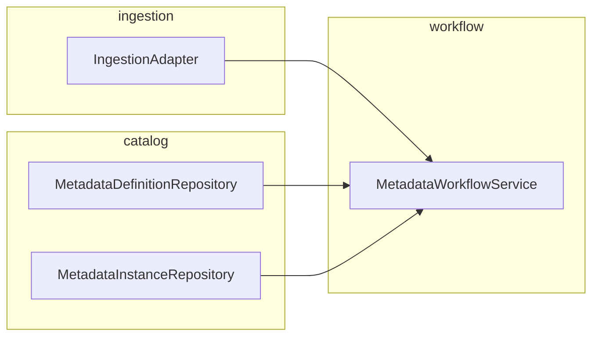

# STU-117 Design

## Metadata

- Linear Issue: STU-117
- Feature Branch: `STU-117-architecture-slice`
- Related Spec Doc: `docs/features/STU-117/spec.md`
- Related Validation Doc: `docs/features/STU-117/validation.md`
- Figma Link(s): N/A (backend architecture slice)

## Design Summary

Introduce a small **metadata domain** package that separates:

1. **Stable catalog** (`DatasetDefinition`) from **period instances**
   (`DatasetInstance`).
2. **Ingestion** (`IngestionAdapter`) from **editor workflow**
   (`MetadataWorkflowService`).
3. **Policy gating** (`PreviewGateReport`) from **state mutation** (workflow
   service methods).

## UX States

- N/A at HTTP layer in this slice; conceptual editor states map to
  `MetadataLifecycleState`: draft, preview, published.

## Interaction Flows

### Metadata editor (conceptual)

1. Ingestion adapter describes raw source (`IngestionSourceDescriptor`).
2. System creates `MetadataRevision` in `draft`.
3. Validation slice produces `PreviewGateReport`; on success, revision moves to
   `preview`.
4. Human or automated approval triggers `publish` to `published`.
5. User may `discard_preview` to return to `draft` from `preview` only.

### Tenant safety

- Every workflow method accepts `tenant_id` and compares it to the stored
  revision tenant; mismatch raises `TenantIsolationError`.

## Component/Module Boundaries

| Module / type | Responsibility |
| ------------- | -------------- |
| `models.py` | Immutable aggregates and value objects |
| `protocols.py` | Ports for adapters, repos, workflow |
| `workflow.py` | Reference `InMemoryMetadataWorkflowService` |
| `errors.py` | Typed domain exceptions |

## Edge Cases

- Preview gate fails: remain in `draft`; no partial `preview` state.
- Unknown `revision_id`: `MetadataNotFoundError`.
- `published` is terminal: no `submit_for_preview` or `discard_preview`.

## Accessibility And Usability Notes

N/A (non-UI).

## Security And Privacy Notes

- Tenant id is mandatory on all workflow entry points.
- Adapters must not return descriptors for sources outside the requested tenant.

## Performance Notes

- In-memory store is for tests only; production adapters should bound memory and
  use persistent storage.

## Rollback Plan

- Revert branch; no persisted user data in this slice.

## Open Questions

- Field-level metadata schema versioning (tracked under STU-114 follow-ups).
- Whether `publish` should accept an explicit compatibility manifest (future).

## Addendum

| Date       | Change                        | Reason                 |
| ---------- | ----------------------------- | ---------------------- |
| 2026-04-06 | Initial package layout        | STU-117 implementation |
